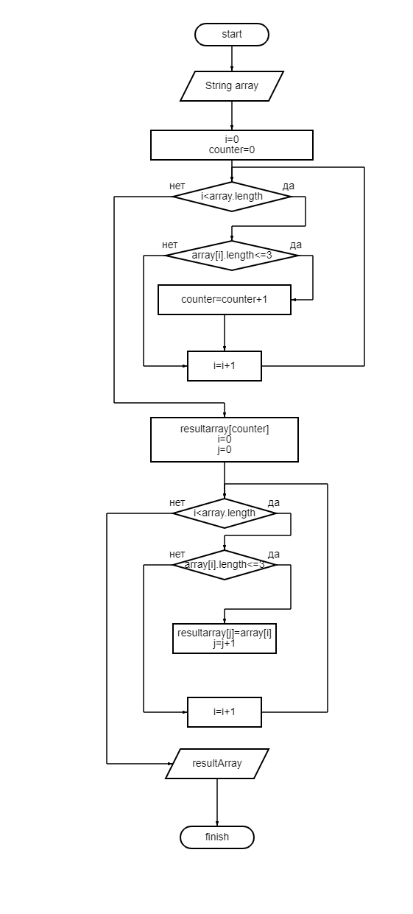

# Задача итоговой контрольной работы по основному блоку курса "Программирования"

*Написать программу, которая из имеющегося массива строк формирует новый массив из строк, длина которых меньше, либо равна 3 символам.*

# Решение:

1. Создание блок-схемы к задаче "Algoritm.png".

2. Создание файла "ReadMe.md".

3. Создание программы "Program.cs", решающей поставленную задачу :

- Функция "FillArray" создана для заполнения массива с консоли;

- Функция "NewArray" создана для записи нового массива, созданного ранее и состощего из не более 3х символов;

- Функция "PrintArray" создана для вывода на консоль старого массива, а затем нового;

- Функция "CountStringSymbols" ведет подчет количества элементов в массиве и записывает массивы, меньше либо равны трем;

4. Отправка все на GitHub. 

